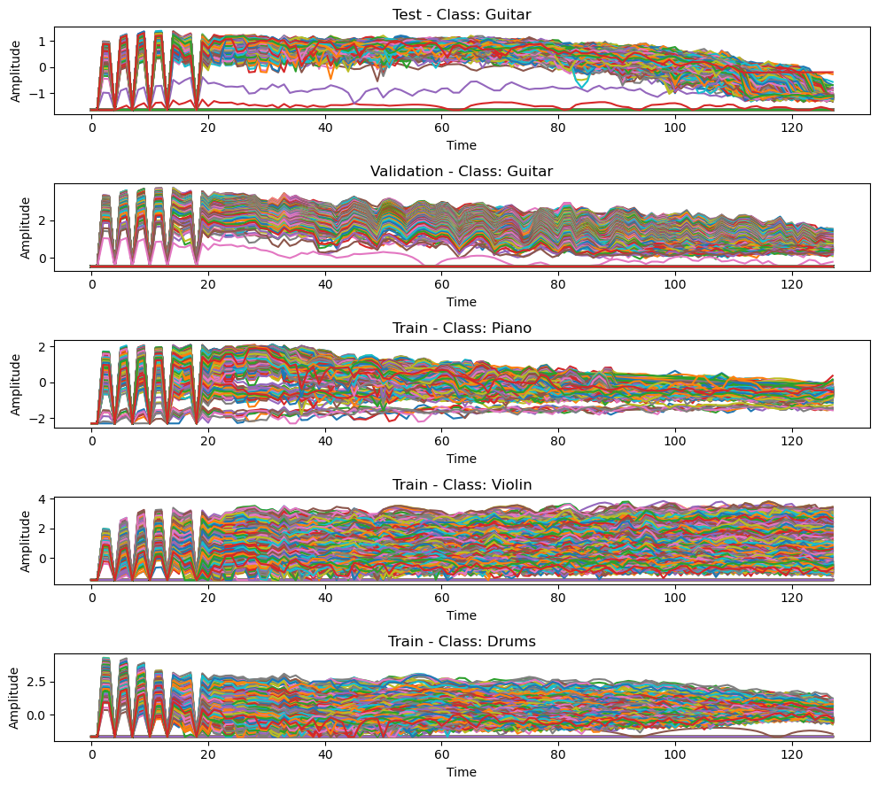
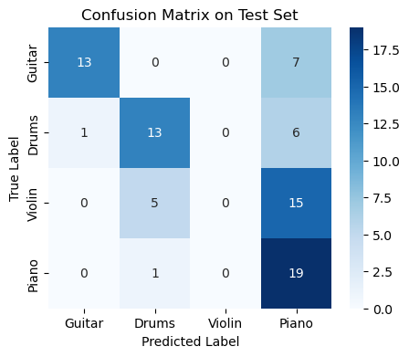
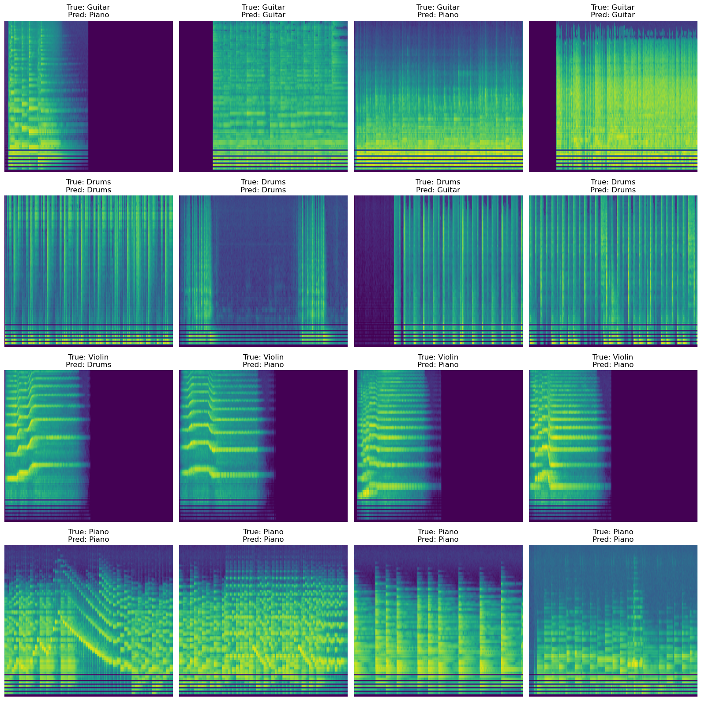
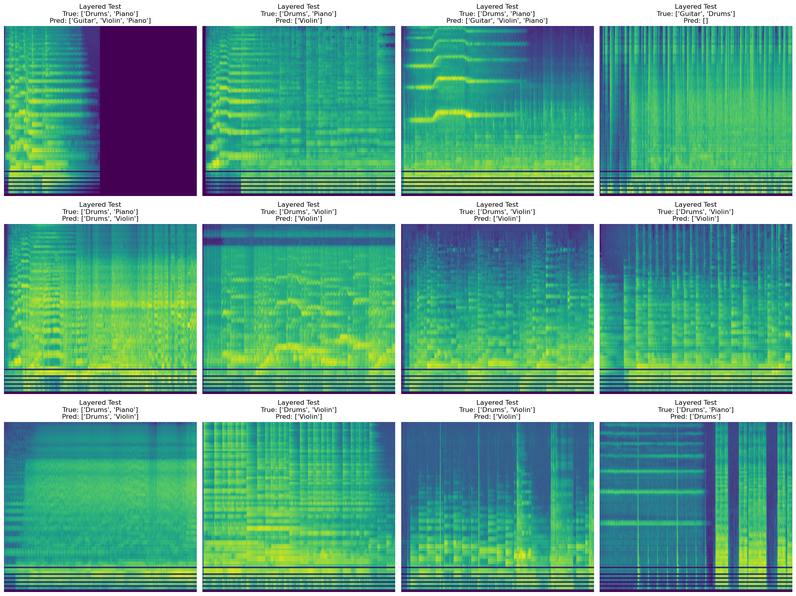
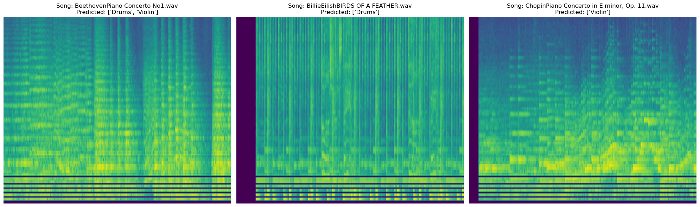

## Project Overview
This project uses a kaggle Instrument Classifier Data set to classify instruments. The labels are either 0, 1, 2, 3, each corresponding to 1 of 4 instruments. 0: Guitar, 1: Drums, 2: Violin, 3: Piano.

## Data Overview
The Instrument Data set has 4 instruments, with labeled audio .wav files. Here is a mel specrogram visualization of some of the data.

## Methods Overview
Data Preparation:
Used a dataset of audio clips containing instruments: Guitar, Drums, Violin, and Piano.
Converted audio clips to Mel Spectrograms (at a fixed length, mono, standardized sample rate).
For layered classification, audio clips were layered from the single-instrument samples to simulate multi-instrument audio.

Model:
A CNN-based classifier with pytorch with convolutional blocks, batch normalization, and max pooling.
For single-instrument classification, the model used CrossEntropyLoss with 4 output classes.
For layered instrument classification, the model output 4 logits and used BCEWithLogitsLoss. Predictions were thresholded at 0.5 to determine whether an instrument was present.

Training:
Trained for a 10 epochs.
Monitored training and validation F1-scores, saving the best model based on validation performance to use in notebooks.
Used micro-F1 and macro-F1 metrics for the layered classification.

## Results
Training & Validation Performance
By the final epoch, the model achieved on validation set:
Train Loss: ~0.3843
Val Loss: ~0.3986
F1-micro: ~0.8104
F1-macro: ~0.8279

Test Performance (Layered Test Data):
Micro F1-score: 0.5338
Macro F1-score: 0.4838

Visulizations:
Confusion Matrix for Single Instrument:

Plotted Expected vs True for Single Instruments:

Plotted Expected vs True for Layered Instruments:

The Final Result for self chosen songs:

All Correct but Chopin is mising the piano.
## Conclusion
The CNN model performs well on single-instrument data, but generalizing to layered audio is more challenging.
On single instrument Piano was easily identified from the model because of the nature of the sound.
The model instead struggled with Violin on single instruments.
However Going to Layered sound the model guessed Violin much more than before.
I assume this has to do with how violin is a much more fluid sound where piano is much more well defined.
Seeing how the model struggles with certain type of audio solo, like the violin, but can easily
identify drums and piano. When looking at the spectrograms of these I think we can see why.
Overall There is are quite a bit of limitations with this model, but the results are satisfying for me.
Future improvements could be longer samples and more/ better augments to the data.
